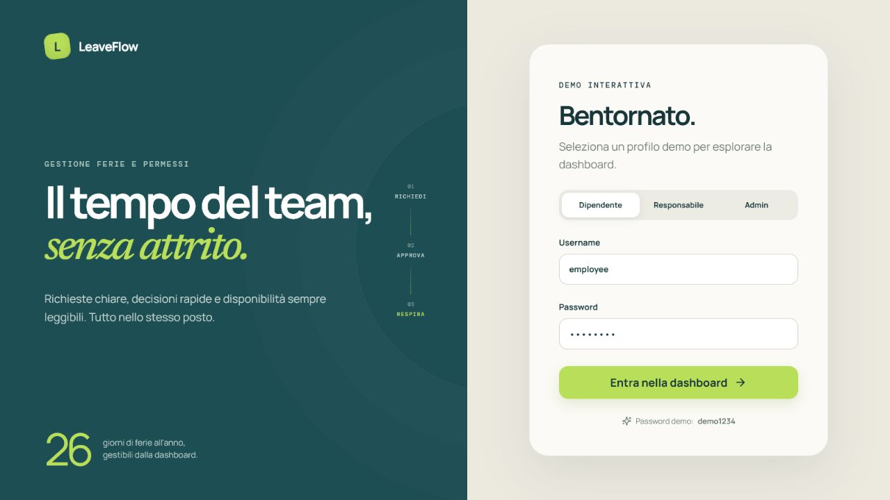
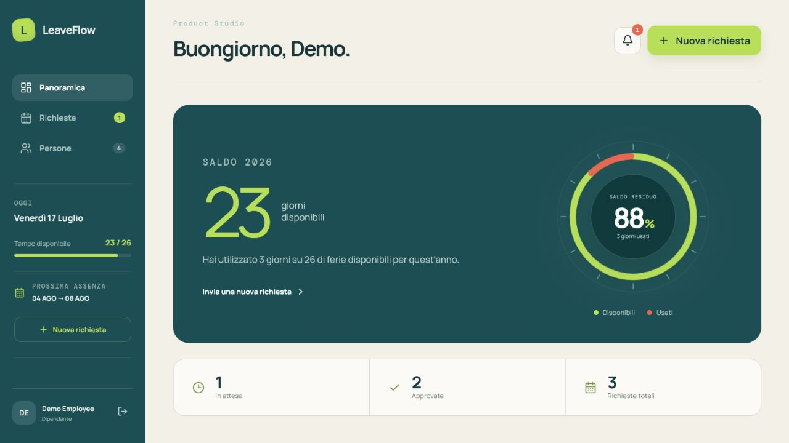
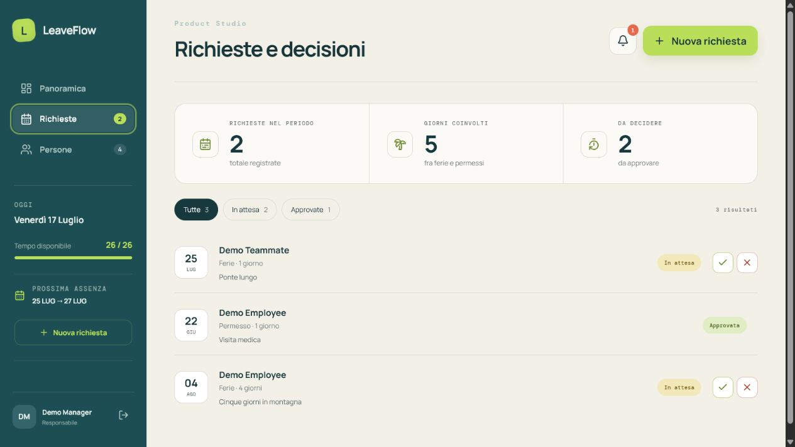
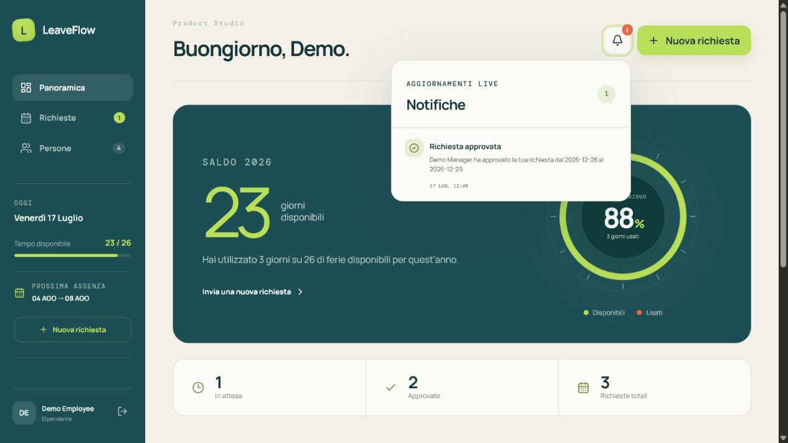
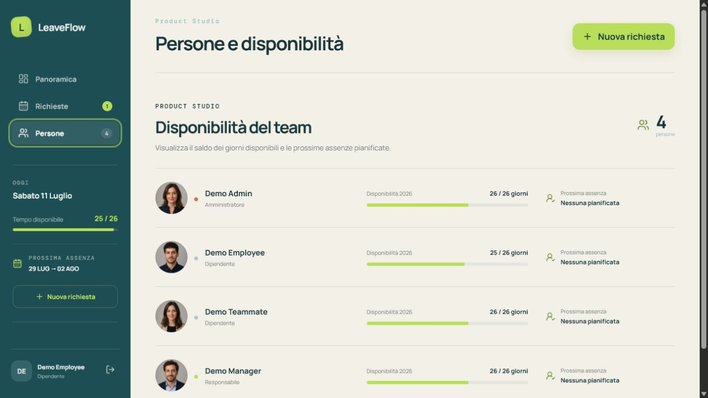

# LeaveFlow

[English](README.md) | [Italiano](README.it.md)

[](https://github.com/cmdr-chara/LeaveFlow/actions/workflows/ci.yml)
[](LICENSE)

Una demo full stack per la gestione di ferie e permessi costruita attorno a una domanda concreta: come possono i dipendenti richiedere un'assenza mentre i responsabili mantengono chiara, a colpo d'occhio, la disponibilità del team?

LeaveFlow copre l'intero flusso, dall'autenticazione e dalla validazione del saldo fino alle decisioni dei responsabili, tramite un'interfaccia Vue responsive e un'API REST Django.



## Panoramica del prodotto

### Saldo annuale immediatamente leggibile

I dipendenti vedono subito i giorni disponibili, le prossime assenze e le richieste recenti. L'indicatore SVG del saldo resta leggero e rispetta le preferenze di movimento ridotto.



### Richieste senza inseguire fogli di calcolo

Le richieste vengono validate in base alle date, alle sovrapposizioni e al saldo disponibile del dipendente. I filtri di stato rendono semplici da consultare sia le decisioni in attesa sia quelle concluse.



### Notifiche in tempo reale basate sul ruolo

Django pubblica gli eventi relativi alle assenze soltanto dopo il completamento della transazione sul database. I responsabili ricevono le nuove richieste e i dipendenti ricevono le decisioni attraverso un feed persistente e deduplicato, aggiornato tramite Server-Sent Events autenticati.



### Disponibilità del team a colpo d'occhio

Responsabili e amministratori possono confrontare saldi e prossime assenze senza aprire calendari separati o i singoli profili dei dipendenti.



## Funzionalità incluse

- autenticazione tramite token con ruoli dipendente, responsabile e amministratore;
- permessi e visibilità delle richieste limitati al team;
- richieste di ferie e permessi con validazione di date, sovrapposizioni e saldo;
- flussi di approvazione e rifiuto da parte dei responsabili;
- riepiloghi nella dashboard, filtri di stato e disponibilità del team;
- API REST, migrazioni del database, dati demo e test automatici;
- interfaccia responsive con animazioni mirate e supporto a `prefers-reduced-motion`;
- localizzazione persistente italiano/inglese per date, plurali, ruoli, stati e notifiche;
- ambiente Docker Compose e CI con GitHub Actions;
- notifiche event-driven in tempo reale tramite un servizio Node.js autenticato;
- consumer group Redis Streams, deduplicazione, feed persistenti e health check;
- log JSON strutturati con correlazione delle richieste, oscuramento dei dati sensibili e arresto controllato.

## Stack

```text
Vue 3 + TypeScript  ──HTTP/Token──>  Django REST Framework  ──ORM──>  PostgreSQL
       :5173                              :8000                         :5432
          │                                  │
          │ REST autenticato + SSE           └──eventi──> Redis Streams
          ▼                                                  │
Servizio notifiche Node.js + TypeScript <──consumer group────┘
                   :3000
```

Frontend, backend e worker delle notifiche sono servizi indipendenti. Django pubblica gli eventi di dominio soltanto dopo il completamento della transazione sul database. Il servizio Node.js li consuma tramite un consumer group Redis, deduplica la consegna, conserva un feed limitato per ciascun utente e invia gli aggiornamenti al client Vue tramite Server-Sent Events autenticati. Ogni token del client viene verificato con Django, evitando di mantenere un secondo sistema di identità.

Docker Compose avvia tutti i servizi insieme a PostgreSQL e Redis. SQLite resta disponibile per lo sviluppo rapido del backend e per i test; quando `REDIS_URL` non è configurato, la pubblicazione degli eventi viene disattivata senza compromettere il flusso principale di gestione delle assenze.

## Avviare la demo

L'unico prerequisito è Docker Desktop.

```bash
docker compose up --build
```

Apri [http://localhost:5173](http://localhost:5173).

| Ruolo | Username | Password |
|---|---|---|
| Dipendente | `employee` | `demo1234` |
| Responsabile | `manager` | `demo1234` |
| Amministratore | `admin` | `demo1234` |

I responsabili possono esaminare le richieste del proprio team. Gli amministratori possono inoltre usare Django Admin all'indirizzo [http://localhost:8000/admin/](http://localhost:8000/admin/).

## Osservabilità

Il servizio Node.js produce log JSON elaborabili automaticamente tramite Pino. Le voci HTTP includono metodo, percorso, stato, tempo di risposta e un `X-Request-Id`; se il client o un reverse proxy fornisce già un request ID, questo viene propagato nella risposta. Gli header di autorizzazione vengono oscurati.

I log del worker contengono volutamente gli identificativi degli eventi e delle richieste, non i dati personali dei dipendenti:

```json
{"level":30,"service":"leaveflow-notifications","environment":"development","eventId":"7cd631cb-d6aa-4142-bd3d-4acb43ef8e26","eventType":"leave.requested","requestId":51,"recipients":1,"delivered":1,"msg":"Leave event processed"}
```

Per seguire il servizio in locale:

```powershell
docker compose logs -f notifications
```

`LOG_LEVEL` può essere impostato su `debug`, `info`, `warn` oppure `error`. L'endpoint `/health` restituisce `503` quando Redis non è disponibile, permettendo a Docker o a un orchestratore di non indirizzare traffico verso un'istanza degradata.

## Avvio senza Docker

Backend:

```powershell
python -m venv .venv
.venv\Scripts\pip install -r requirements.txt
.venv\Scripts\python backend\manage.py migrate
.venv\Scripts\python backend\manage.py seed_demo
.venv\Scripts\python backend\manage.py runserver
```

Frontend:

```powershell
cd frontend
npm install
npm run dev
```

Servizio notifiche (richiede Redis):

```powershell
cd notifications
npm install
$env:REDIS_URL="redis://localhost:6379"
$env:BACKEND_URL="http://localhost:8000"
npm run dev
```

## Verifica

```powershell
.venv\Scripts\python backend\manage.py test leave
cd frontend
npm run build
cd ..\notifications
npm run check
npm test
npm run build
```

La suite automatica copre:

- permessi Django, validazione delle sovrapposizioni, decisioni e instradamento dei destinatari;
- mapping dello schema delle notifiche, confini di autenticazione e isolamento per utente;
- deduplicazione dall'evento di dominio fino alla persistenza e alla pubblicazione in memoria;
- consegna SSE autenticata tramite un vero server HTTP effimero;
- health check delle dipendenze degradate e propagazione del request ID;
- controllo TypeScript rigoroso e build di produzione per Node.js e Vue.

## Ambito e compromessi

- I fine settimana sono esclusi dal conteggio delle ferie; le festività nazionali non sono ancora modellate.
- La gestione di utenti e team avviene tramite Django Admin, così l'interfaccia del prodotto può concentrarsi sul flusso delle assenze.
- L'autenticazione a token attuale è adeguata a una demo locale. In produzione servirebbero politiche di scadenza e revoca, cookie sicuri o un altro sistema di sessione più robusto.
- Redis Streams garantisce una consegna durevole at-least-once e lo store delle notifiche deduplica ogni coppia evento/destinatario. Una distribuzione di produzione aggiungerebbe anche una dead-letter queue e metriche per gli eventi ripetutamente non validi.
- I dati demo possono essere ripristinati in qualsiasi momento con `python backend/manage.py seed_demo`.

I prossimi sviluppi naturali includono un audit log, calendari delle festività, delega temporanea delle approvazioni, esportazione verso calendari e SSO.

## Licenza

LeaveFlow è distribuito con [licenza MIT](LICENSE).
