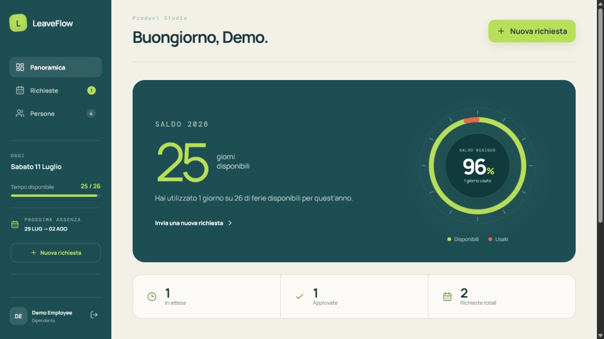
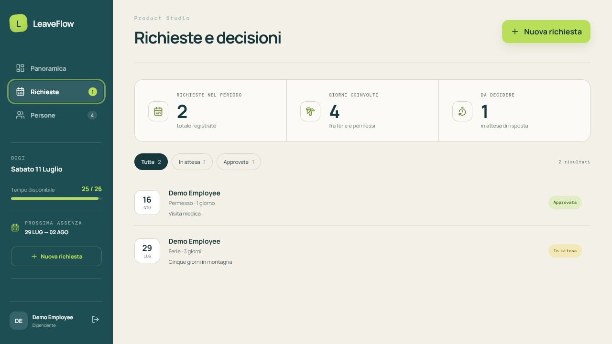

# LeaveFlow

A full-stack leave management demo built around one practical question: how can employees request time off while managers keep team availability clear at a glance?

LeaveFlow covers the complete workflow—from authentication and balance validation to manager decisions—through a responsive Vue interface and a Django REST API.



## Product walkthrough

### A clear annual balance

Employees can immediately see their remaining allowance, upcoming leave and recent requests. The SVG balance gauge stays lightweight and adapts to reduced-motion preferences.

### Requests without spreadsheet archaeology

Requests are validated against dates, overlaps and the employee's available balance. Status filters keep pending and completed decisions easy to scan.



### Team availability at a glance

Managers and administrators can compare balances and upcoming absences without opening separate calendars or employee profiles.


## What is included

- token-based authentication with employee, manager and administrator roles;
- team-scoped permissions and request visibility;
- leave and permission requests with date, overlap and balance validation;
- manager approval and rejection flows;
- dashboard summaries, status filters and team availability;
- REST API, database migrations, demo seed data and automated tests;
- responsive UI with focused motion and reduced-motion support;
- Docker Compose environment and GitHub Actions CI.

## Stack

```text
Vue 3 + TypeScript  ──HTTP/Token──>  Django REST Framework  ──ORM──>  PostgreSQL
       :5173                              :8000                         :5432
```

The frontend and backend are independent services. Docker Compose runs them with PostgreSQL for the full local setup, while SQLite remains available for quick backend development and tests.

## Run the demo

Docker Desktop is the only prerequisite.

```bash
docker compose up --build
```

Open [http://localhost:5173](http://localhost:5173).

| Role | Username | Password |
|---|---|---|
| Employee | `employee` | `demo1234` |
| Manager | `manager` | `demo1234` |
| Administrator | `admin` | `demo1234` |

Managers can review requests for their team. Administrators can also use Django Admin at [http://localhost:8000/admin/](http://localhost:8000/admin/).

## Run without Docker

Backend:

```powershell
python -m venv .venv
.venv\Scripts\pip install -r requirements.txt
.venv\Scripts\python backend\manage.py migrate
.venv\Scripts\python backend\manage.py seed_demo
.venv\Scripts\python backend\manage.py runserver
```

Frontend:

```powershell
cd frontend
npm install
npm run dev
```

## Verification

```powershell
.venv\Scripts\python backend\manage.py test leave
cd frontend
npm run build
```

## Scope and trade-offs

- Weekends are excluded from leave totals; national holidays are not modelled yet.
- User and team administration is handled through Django Admin so the product UI can focus on the leave workflow.
- The current token authentication is appropriate for a local demo. Production would require expiration and revocation policies, secure cookies or another hardened session strategy.
- Demo data can be restored at any time with `python backend/manage.py seed_demo`.

Natural next steps include notifications, an audit log, public-holiday calendars, temporary approval delegation, calendar export and SSO.
